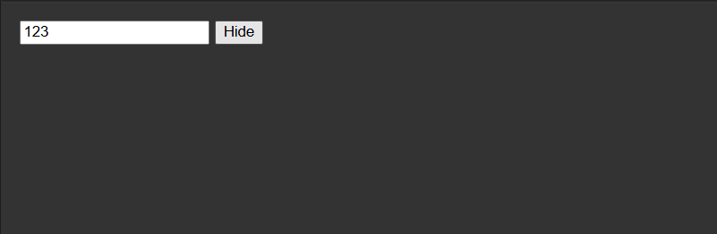
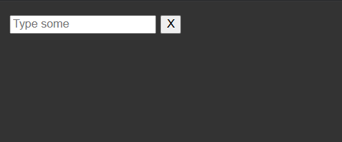
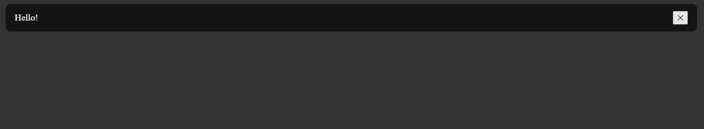
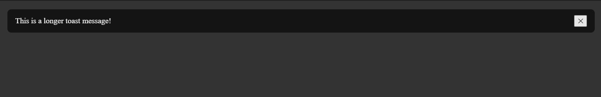
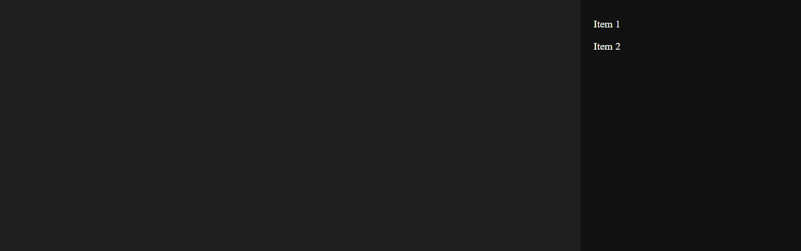
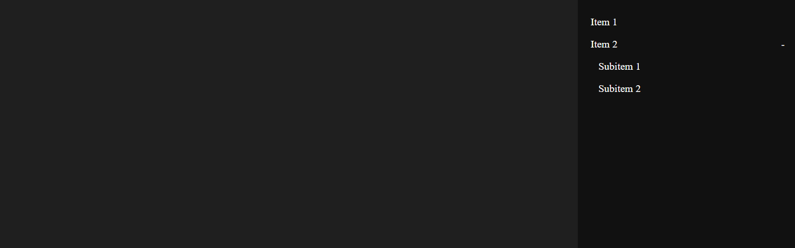

# React Component Library

This is a React component library with Storybook documentation.
It includes: `Input`, `Toast` with a queue system, and `SidebarMenu` with nested items.

---

## 💾 Project Structure

```
src/
 └─ components/
     ├─ Input/
     │   ├─ Input.tsx
     │   └─ Input.stories.tsx
     ├─ Toast/
     │   ├─ Toast.tsx
     │   ├─ ToastContainer.tsx
     │   └─ Toast.stories.tsx
     └─ SidebarMenu/
         ├─ SidebarMenu.tsx
         ├─ SidebarItem.tsx
         └─ SidebarMenu.stories.tsx
```

---

## 🚀 Running Storybook

```bash
npm install
npm run storybook
```

Storybook will open at `http://localhost:6006`.

---

## 🧩 Components & Stories

### Input

* Text Input
* Password Input with show/hide toggle
* Clearable Input

Example usage:

```tsx
<Input type="text" placeholder="Enter message" clearable />
```

### Toast

* Toast notifications with a queue system (max 3 visible at once)
* Customizable message, type (`success` | `error`), and duration

Example usage:

```tsx
const { showToast } = useToast();
showToast({ message: 'Hello', type: 'success', duration: 5000 });
```

### SidebarMenu

* Collapsible menu with nested items
* Supports multiple levels

Example usage:

```tsx
<SidebarMenu isOpen={true} onClose={() => {}} items={menuItems} />
```

---

## 📸 Screenshots

### Input Component

**Text Input**


**Password Input**


**Clearable Input**


---

### Toast Component

**Short Toast**


**Long Message Toast**


---

### SidebarMenu Component

**One-level Menu**


**Two-level Menu**


---

## ⚡ Notes

* Toast notifications support a queue with up to 3 visible toasts. New toasts will wait until a visible slot is free.
* Input component uses `onValueChange` for controlled updates.
* SidebarMenu handles nested items recursively with smooth animations.
